# Mermaid Diagrams Expert Skill

Comprehensive Mermaid syntax guidance covering all major diagram types, theming, and common gotchas. Based on the official Mermaid documentation.

## When to Use This Skill

**Activate this skill when:**
- Creating or editing any Mermaid diagram inside a markdown file or code block
- Choosing which diagram type best fits the information to visualize
- Debugging broken Mermaid syntax
- Styling or theming a diagram

**Don't use this skill for:**
- PlantUML, draw.io, Graphviz, or other diagram tools
- Diagrams embedded in Confluence/Lucidchart with their own syntax

---

## Diagram Type Chooser

| Goal | Use |
|---|---|
| Process flow, decision tree | Flowchart |
| API calls, system interactions over time | Sequence Diagram |
| OOP class structure | Class Diagram |
| State machine / lifecycle | State Diagram |
| Database schema | ER Diagram |
| Git branching strategy | GitGraph |
| Project schedule | Gantt |
| Brainstorm / hierarchy | Mindmap |
| Historical events / roadmap | Timeline |
| Proportions | Pie Chart |

---

## Flowchart

### Direction

```
flowchart TD   ← Top-down (default)
flowchart LR   ← Left-right
flowchart BT   ← Bottom-top
flowchart RL   ← Right-left
```

### Node Shapes

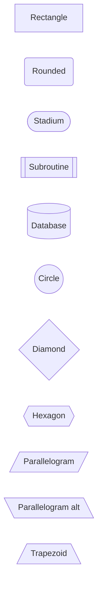

### Link Types

```
A --> B          Arrow
A --- B          Open line (no arrow)
A -->|label| B   Arrow with label
A -- label --> B Arrow with label (alternate)
A -.-> B         Dotted arrow
A -. label .-> B Dotted with label
A ==> B          Thick arrow
A ~~~  B         Invisible link (layout hint)
A --o B          Circle at end
A --x B          Cross at end
```

Add extra dashes/dots to increase edge length: `A ----> B`

### Subgraphs

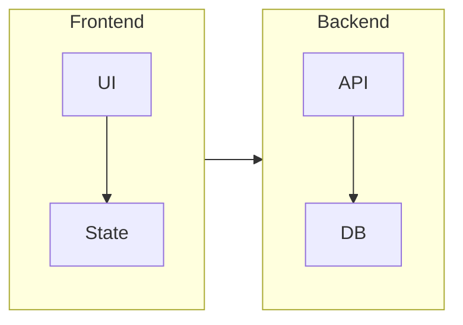

### Styling

```
%% Inline style
style A fill:#4CAF50,stroke:#388E3C,color:#fff

%% Reusable class
classDef warning fill:#FFC107,stroke:#FF8F00,color:#000
class B,C warning

%% Shorthand attach
D:::warning
```

### Gotchas

- `end` is a reserved word — use `End` or `END` inside node labels
- Node IDs starting with `o` or `x` can break arrow parsing — quote or capitalize
- Special characters in labels must be quoted: `A["text with (parens)"]`
- Subgraph direction is ignored when nodes have edges crossing outside the subgraph

---

## Sequence Diagram

### Participants

```
sequenceDiagram
    participant C as Client
    participant S as Server
    actor       U as User       %% Stick figure icon
```

Participants render in declaration order. Declare them explicitly to control layout.

### Message Arrows

| Syntax | Style | Arrowhead |
|---|---|---|
| `A->B: msg` | Solid | None |
| `A-->B: msg` | Dotted | None |
| `A->>B: msg` | Solid | Open |
| `A-->>B: msg` | Dotted | Open |
| `A-xB: msg` | Solid | Cross (lost) |
| `A--xB: msg` | Dotted | Cross (lost) |
| `A-)B: msg` | Solid | Open async |
| `A--)B: msg` | Dotted | Open async |

### Activation

```
A->>+B: Request    %% activate B
B-->>-A: Response  %% deactivate B

%% Or explicit
activate B
deactivate B
```

### Control Flow Blocks

```
loop Retry up to 3 times
    C->>S: Request
    S-->>C: Response
end

alt Success
    S-->>C: 200 OK
else Error
    S-->>C: 500 Error
end

opt Has Auth Token
    C->>S: Bearer token
end

par In parallel
    C->>S1: Call service 1
and
    C->>S2: Call service 2
end

break On exception
    S-->>C: 503 Unavailable
end
```

### Notes

```
Note right of A: This is a note
Note over A,B: Spans two participants
```

### Background Highlighting

```
rect rgb(191, 223, 255)
    A->>B: Highlighted section
end
```

### Autonumber

```
sequenceDiagram
    autonumber
    A->>B: First message
    B-->>A: Second message
```

---

## Class Diagram

### Basic Class

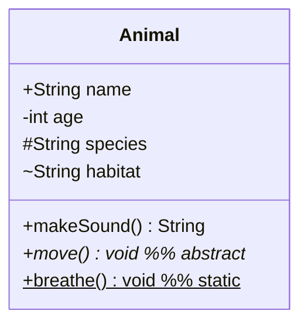

Visibility: `+` public, `-` private, `#` protected, `~` package

### Relationships

```
Animal <|-- Dog          Inheritance (extends)
Car *-- Engine           Composition (owns, lifecycle tied)
Pond o-- Duck            Aggregation (has, independent lifecycle)
Student --> Course       Association (uses)
Driver ..> Car           Dependency (uses temporarily)
Shape ..|> Drawable      Realization (implements)
```

With cardinality:

```
Customer "1" --> "0..*" Order : places
```

Cardinality options: `1`, `0..1`, `1..*`, `*`, `n`, `0..n`, `1..n`

### Annotations

```
class PaymentService {
    <<Interface>>
    +process(amount: float) bool
}

class UserModel {
    <<Abstract>>
}
```

Common: `<<Interface>>`, `<<Abstract>>`, `<<Service>>`, `<<Enumeration>>`

### Namespaces

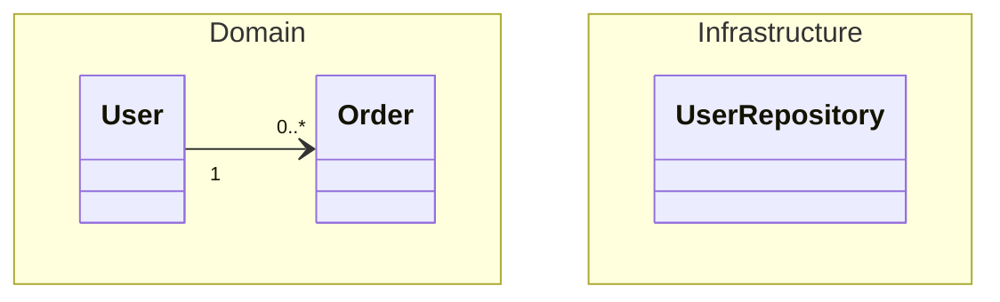

### Generics

```
class Stack~T~ {
    +push(item: T) void
    +pop() T
}
```

---

## State Diagram

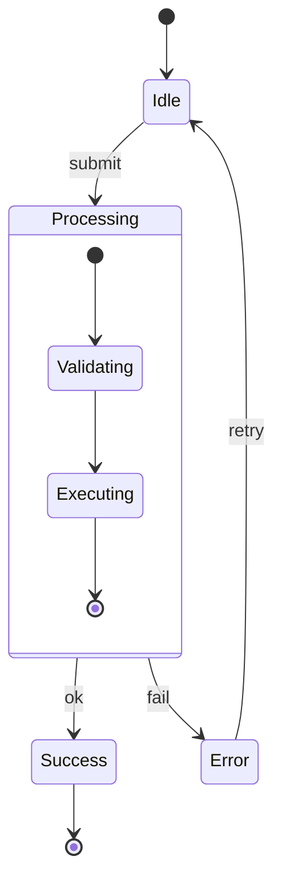

### Direction

```
stateDiagram-v2
    direction LR
```

### Fork / Join (Concurrency)

```
state fork_state <<fork>>
[*] --> fork_state
fork_state --> Branch1
fork_state --> Branch2

state join_state <<join>>
Branch1 --> join_state
Branch2 --> join_state
join_state --> [*]
```

### Parallel Regions

```
state ParallelWork {
    [*] --> TaskA
    --
    [*] --> TaskB
}
```

### Notes

```
StateA : This is a note on StateA
note right of StateB
    Multi-line note
    on state B
end note
```

---

## Entity Relationship Diagram

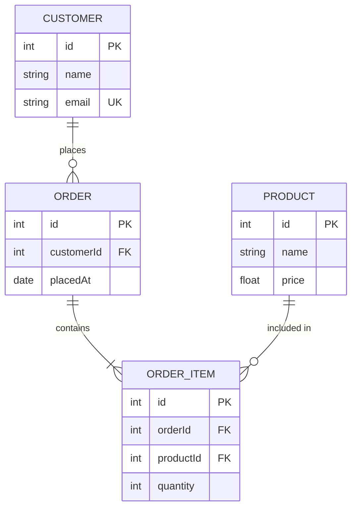

### Cardinality Reference

| Left | Right | Meaning |
|---|---|---|
| `\|o` | `o\|` | Zero or one |
| `\|\|` | `\|\|` | Exactly one |
| `}o` | `o{` | Zero or more |
| `}\|` | `\|{` | One or more |

Use `--` (solid) for identifying relationships, `..` (dashed) for non-identifying:

```
PARENT ||--o{ CHILD : "owns"          %% identifying (solid)
USER   }o..o{ ROLE  : "assigned to"   %% non-identifying (dashed)
```

---

## GitGraph

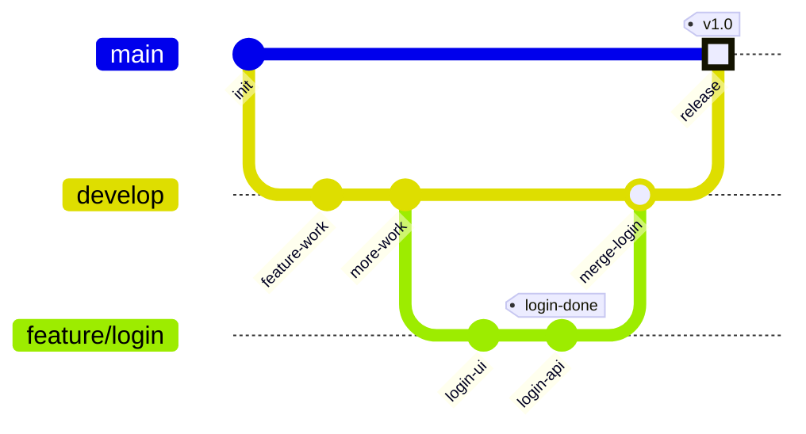

### Commit Types

```
commit type: NORMAL     %% Default — solid circle
commit type: REVERSE    %% Crossed circle (revert)
commit type: HIGHLIGHT  %% Filled rectangle (release)
```

### Orientation

```
gitGraph LR:   %% Left-to-right (default)
gitGraph TB:   %% Top-to-bottom
```

### Cherry-pick

```
cherry-pick id: "abc123"   %% id must exist on a different branch
```

---

## Gantt Chart

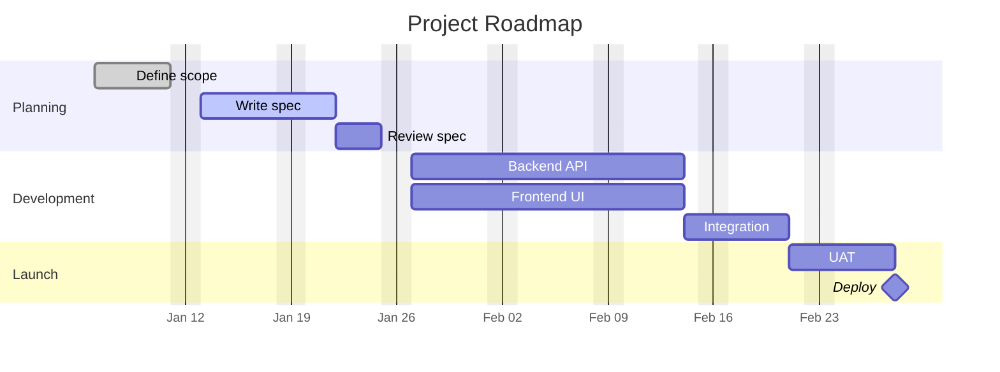

### Task Status Tags

```
done      — Grey fill (completed)
active    — Blue fill (in progress)
crit      — Red fill (critical path)
milestone — Diamond marker (zero duration)
```

### Date Formats

```
dateFormat YYYY-MM-DD    %% 2025-01-15
dateFormat DD/MM/YYYY    %% 15/01/2025
dateFormat X             %% Unix timestamp
```

### Axis Formats (strftime)

```
%Y-%m-%d     2025-01-15
%b %d        Jan 15
%d/%m        15/01
%W           Week number
```

---

## Mindmap

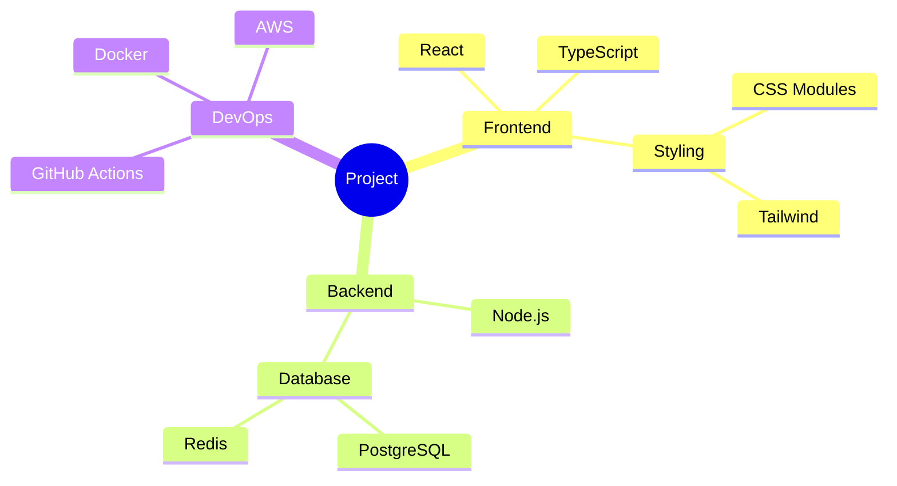

### Node Shapes

```
root((Circle))
child[Square]
child(Rounded)
child{{Hexagon}}
child)Bang(!
```

### Markdown in Nodes

```
mindmap
    root
        **Bold topic**
        *Italic topic*
        Multi-word
        topic here
```

---

## Timeline

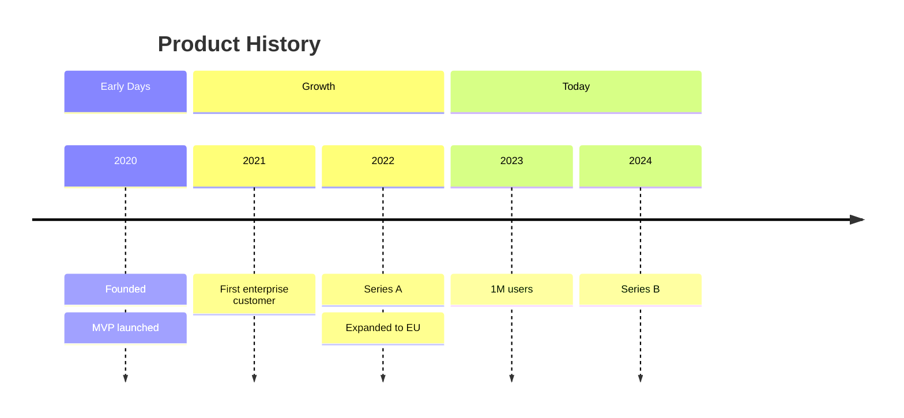

---

## Pie Chart

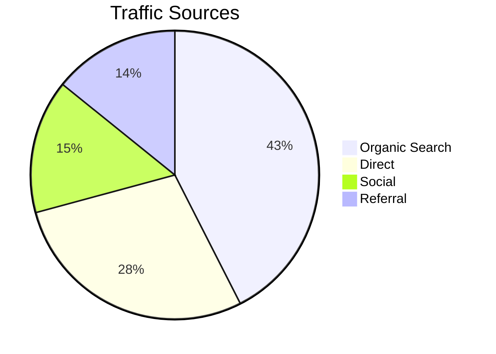

---

## Theming and Configuration

### Per-Diagram Theme (Frontmatter)

````markdown
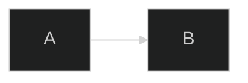
````

Available themes: `default`, `dark`, `forest`, `neutral`, `base`

### Init Directive (inline config)

```
%%{init: {"theme": "dark", "flowchart": {"curve": "basis"}}}%%
flowchart LR
    A --> B
```

### Custom Colors with `base` Theme

```
%%{init: {
  "theme": "base",
  "themeVariables": {
    "primaryColor": "#4A90D9",
    "primaryTextColor": "#ffffff",
    "primaryBorderColor": "#2171B5",
    "lineColor": "#666666",
    "background": "#1a1a2e"
  }
}}%%
```

Theme variables only accept hex colors (e.g., `#ff0000`), not CSS color names.

---

## Embedding in Markdown

Standard fenced code block with `mermaid` language tag:

````markdown

````

Supported natively in: GitHub, GitLab, Notion, Obsidian, VS Code (with extension), Docusaurus, many static site generators.

---

## Common Gotchas

| Problem | Fix |
|---|---|
| `end` inside a flowchart label causes parse error | Capitalize: `[End]` or `[END]` |
| Node ID starting with `o` breaks `-->o` arrow | Capitalize or rename the node |
| Special chars in labels (parens, brackets) | Wrap in quotes: `A["label (with parens)"]` |
| Sequence diagram participants out of order | Declare all `participant` lines at the top |
| ER diagram cardinality looks wrong | Ensure you're reading left-to-right: `A ||--o{ B` means A has one, B has many |
| Class diagram generic type breaks | Use tildes: `List~String~`, not angle brackets |
| GitGraph cherry-pick fails | The `id` must exist on a branch other than the current one |
| Gantt `after` dependency not working | The referenced task must have an explicit `id` |
| Diagram renders blank | Check for unclosed `subgraph`/`end`, `loop`/`end`, or `state {}` blocks |
