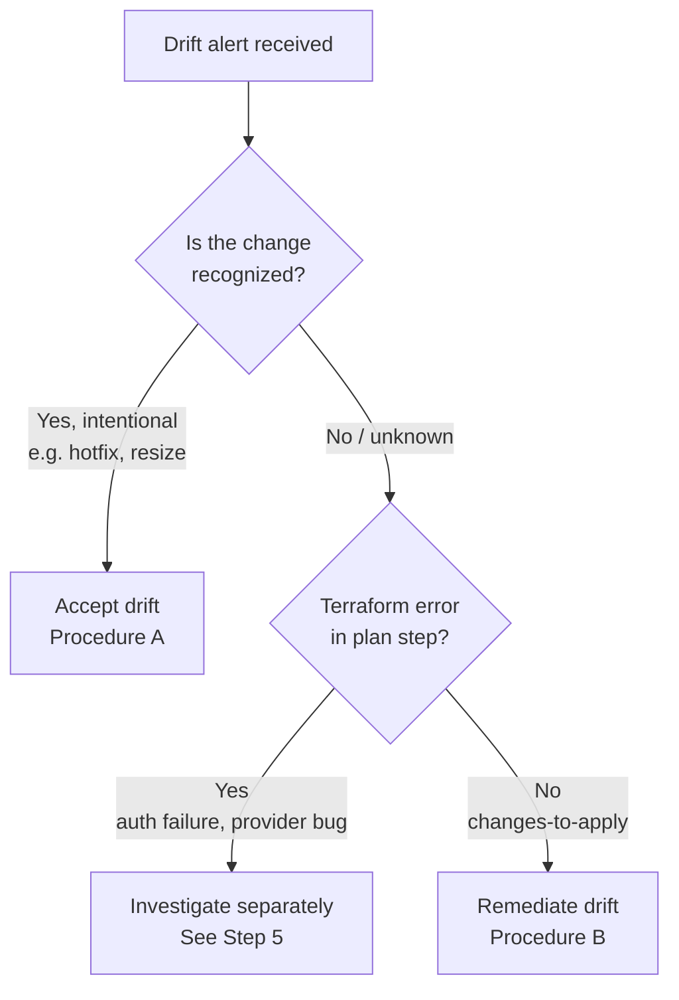

# Drift Remediation Runbook

| Field | Value |
|-------|-------|
| **Trigger** | Slack alert, email, or nightly [`tf-drift`](../../.github/workflows/tf-drift.yaml) workflow run showing drift in one or more Terraform workspaces |
| **Goal** | Determine whether to accept the drift (update IaC to match AWS) or remediate it (apply Terraform to force AWS back to the desired state), then clear the alert |

---

## Step 1 — Locate the Drift

1. Open the workflow run linked in the alert (Slack button or email link).
2. In the **Summary** tab, find the drift table:

   | Project | Workspace |
   |---------|-----------|
   | `tf-network-spoke` | `prod` |

3. Click the workspace link in the per-project job to open the step detail.
4. Expand the **Check for drift** step to read the full Terraform plan diff — this shows exactly what changed.

> Only workspaces with `❌ Drift detected` require action. `✅ No drift` rows are informational.

---

## Step 2 — Classify the Drift



**Recognizing a Terraform error vs. drift:**
- Drift = the plan step shows resource diffs and the `dflook/terraform-check` step reports
  `failure-reason: changes-to-apply`. This is expected output, not a job failure.
- Error = the plan step itself failed (red ✗), typically due to auth, provider, or state issues.
  Treat these separately — do not attempt remediation until the error is resolved.

---

## Procedure A — Accept Drift (Update IaC to Match AWS)

Use this when the AWS change was intentional: a hotfix applied directly in the console,
a resource resized by another team, a manual security group rule added during an incident.

1. **Confirm the change** — run an on-demand plan to get a clean diff:
   - Go to Actions → **Terraform Plan** (`tf-plan.yaml`) → Run workflow.
   - Select the affected project and workspace.
   - Read the summary table in the job output.

2. **Update the Terraform** — edit the relevant `tf-<project>/` files to match the real-world
   state. The goal is a plan that shows zero changes.

3. **Open a PR** — CI (`tf-ci.yaml`) will run fmt → validate → plan. Confirm the plan shows
   no diff before merging.

4. **Merge** — `tf-release.yaml` triggers automatically. For workspaces with
   `continuous-deploy: true` (dev, staging) the apply runs automatically. For `prod`
   (`continuous-deploy: false`) trigger a manual **Terraform Release** dispatch and approve
   the GitHub Environment gate.

5. **Verify** — re-run `tf-drift.yaml` manually (Actions → Terraform Drift Detection →
   Run workflow) and confirm the workspace now shows ✅ No drift.

---

## Procedure B — Remediate Drift (Force AWS Back to IaC)

Use this when the change is unauthorized, accidental, or of unknown origin — and the
correct state is the Terraform configuration, not what is in AWS.

1. **Confirm the remediation plan** — run `tf-plan.yaml` for the affected project/workspace
   and read the output carefully. Look for any `- destroy` lines. A destroy of an unexpected
   resource is a signal to pause and investigate before proceeding.

2. **Trigger apply** — merge any pending IaC changes, or push an empty commit to trigger
   `tf-release.yaml`:
   ```bash
   git commit --allow-empty -m "chore: trigger drift remediation for <project>/<workspace>"
   git push
   ```

3. **Approve the environment gate** — for `staging` and `prod`, the apply is held at the
   GitHub Environment (`terraform/<project>/<workspace>`) pending a required reviewer.
   Go to the workflow run and click **Review deployments → Approve**.

4. **Monitor the apply** — watch the `_tf-workspace-release` job. The apply uses the saved
   plan artifact, so what you approved in step 1 is exactly what runs.

5. **Verify** — re-run `tf-drift.yaml` manually and confirm ✅ No drift.

---

## Step 5 — Investigate Root Cause

Before accepting or remediating, determine what changed and why. This prevents the drift from
recurring.

1. **Check CloudTrail** — in the AWS Console, open CloudTrail → Event history. Filter by:
   - **Time range:** narrow to the last 24–48 hours
   - **Resource name:** the resource ID shown in the Terraform diff

2. **Identify the caller** — look at `userIdentity.arn` to see which IAM principal made
   the change and what service or session initiated it.

3. **Common sources:**

   | Source | Resolution |
   |--------|------------|
   | Manual console change (known) | Accept drift (Procedure A) |
   | Manual console change (accidental) | Remediate (Procedure B) |
   | Another automation tool | Coordinate with that tool's owner; update IaC ownership |
   | IAM role with unexpected write access | Tighten the role, then remediate |
   | AWS-managed service modification | Typically accept — some resources update themselves |

---

## Escalation

**Stuck state lock during remediation:**
- Do not run `terraform force-unlock` from the terminal — it is blocked.
- Go to Actions → **Terraform Force Unlock** (`tf-unlock.yaml`) → Run workflow.
- Select the project and workspace, paste the lock ID from the Terraform error message.

**Cannot determine root cause:**
Escalate before taking any remediation action. Applying Terraform over an unknown change
can overwrite valid state or destroy resources that another system depends on.
