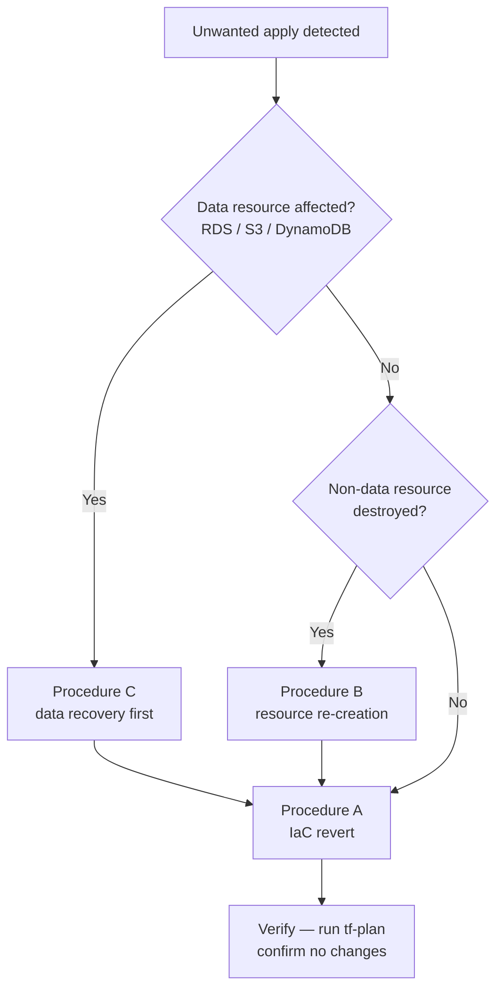

# Rollback Runbook

| Field | Value |
|-------|-------|
| **Trigger** | A `terraform apply` completed successfully but produced an unwanted change — incorrect configuration, accidental resource replacement or deletion, or a broken deployment |
| **Goal** | Restore the affected workspace to its last known-good state with minimal data loss |

---

## Step 1 — Identify What Changed

1. Open the **Actions** tab in GitHub and locate the `tf-release.yaml` run that applied the change.
2. Click the job for the affected project and workspace.
3. Expand the **Apply** step and read the `tf-summarize` output table — it lists every resource that was added, changed, or destroyed.
4. Note the **commit SHA** of the merge that triggered the apply:

   ```bash
   git log --oneline main | head -10
   ```

5. Classify the affected resources using the table below before proceeding:

   | Resource type | Reversibility | Procedure |
   |---------------|---------------|-----------|
   | Configuration change (no replacement) | High — re-apply from reverted IaC | A |
   | Non-data resource destroyed (SG, IAM role, EC2) | Medium — recreate via Terraform | B |
   | RDS / Aurora instance or cluster destroyed | Low — restore from snapshot | C |
   | S3 bucket deleted | Low — restore from versioning or replication | C |
   | DynamoDB table deleted | Low — restore from PITR | C |

---

## Step 2 — Choose a Recovery Path



If more than one category applies, work in order: C → B → A.

---

## Procedure A — IaC Revert (Re-apply from Prior Config)

Use this for every rollback. Even when Procedure B or C is required first, a clean IaC revert must follow to prevent the bad configuration from re-applying on the next release.

1. **Create a revert branch:**

   ```bash
   git checkout main && git pull
   git checkout -b INFRA-<ticket>/rollback-<project>-<workspace>
   ```

2. **Revert the offending commit:**

   ```bash
   git revert <bad-commit-sha> --no-edit
   ```

   If multiple commits are involved, revert them in reverse order (newest first):

   ```bash
   git revert <sha-3> --no-edit
   git revert <sha-2> --no-edit
   git revert <sha-1> --no-edit
   ```

3. **Push and open a PR:**

   ```bash
   git push -u origin HEAD
   ```

   CI (`tf-ci.yaml`) runs fmt → validate → plan. Read the plan output before merging — confirm it shows the expected restoration and no unexpected destroys.

4. **Merge** — `tf-release.yaml` triggers automatically. For `dev` and `staging` (both have `continuous-deploy: true`) the apply runs immediately. For `prod` (`continuous-deploy: false`), dispatch **Terraform Release** manually and approve the GitHub Environment gate.

5. **Verify** — run an on-demand plan after the apply:
   - Go to **Actions → Terraform Plan** (`tf-plan.yaml`) → **Run workflow**.
   - Select the same project and workspace.
   - Confirm the plan shows **No changes**.

---

## Procedure B — Non-Data Resource Re-creation

Use this when the apply destroyed a resource that cannot be recovered from a snapshot — for example, a security group, IAM role, EC2 instance, or VPC endpoint.

### B1 — Check whether the resource still exists in AWS

```bash
# Example: security group
aws ec2 describe-security-groups \
  --filters "Name=group-name,Values=<name>" \
  --region <region>

# Example: IAM role
aws iam get-role --role-name <role-name>
```

If the resource was never deleted (e.g., a configuration-only change accidentally triggered a replace), skip to B3 — the resource exists but Terraform's state may be out of sync.

### B2 — Restore the resource definition in IaC

In the revert branch created in Procedure A Step 1, confirm the `git revert` has already restored the resource block in the Terraform files. Do not merge yet.

### B3 — Import if the resource exists in AWS but not in state

If the resource exists in AWS (e.g., manually recreated), import it before applying:

```bash
terraform import <resource_address> <aws_resource_id>
```

Examples:

```bash
terraform import aws_security_group.alb sg-0abc123def456789
terraform import aws_iam_role.app MyAppRole
```

Run `terraform plan` locally to confirm the import produced a clean no-change plan before merging the revert PR.

### B4 — Apply the revert (via Procedure A)

Once the IaC accurately reflects the desired state, continue with Procedure A Step 3 (open PR, merge, approve gate).

---

## Procedure C — Data Resource Recovery

Data resources (RDS, S3, DynamoDB) cannot be recovered by re-applying Terraform. Restore the data first, then run Procedure A to bring IaC back into sync.

> **Before restoring:** coordinate with application teams. A database or bucket restored to a prior point in time while the application is writing new data will cause split-brain. Arrange a maintenance window or read-only mode if necessary.

### C1 — RDS / Aurora

AWS takes automated snapshots every 5 minutes (PITR) and daily snapshots by default.

1. Open the AWS Console → **RDS → Automated backups** → locate the instance or cluster.
2. Click **Restore to point in time** and select a time before the bad apply.
3. Restore to a **new** instance identifier (e.g., `<original-id>-restored`).
4. Verify the restored instance is healthy and data is intact.
5. Rename or swap endpoints as needed (update SSM parameters if the endpoint changes).

```bash
aws rds restore-db-instance-to-point-in-time \
  --source-db-instance-identifier <original-id> \
  --target-db-instance-identifier <original-id>-restored \
  --restore-time <ISO8601-timestamp> \
  --region <region>
```

### C2 — S3

If S3 Versioning is enabled, objects are never truly deleted — only marked with a delete marker.

1. List object versions to find the last known-good version:

   ```bash
   aws s3api list-object-versions \
     --bucket <bucket-name> \
     --prefix <key-prefix> \
     --region <region>
   ```

2. Restore a specific version by copying it back as the current version:

   ```bash
   aws s3api copy-object \
     --bucket <bucket-name> \
     --copy-source "<bucket-name>/<key>?versionId=<version-id>" \
     --key <key> \
     --region <region>
   ```

3. To remove a delete marker (undelete an object):

   ```bash
   aws s3api delete-object \
     --bucket <bucket-name> \
     --key <key> \
     --version-id <delete-marker-version-id> \
     --region <region>
   ```

### C3 — DynamoDB

DynamoDB PITR allows restore to any second within the last 35 days.

1. Identify the table and the target restore time (before the bad apply).
2. Restore to a new table name:

   ```bash
   aws dynamodb restore-table-to-point-in-time \
     --source-table-name <original-table> \
     --target-table-name <original-table>-restored \
     --restore-date-time <ISO8601-timestamp> \
     --region <region>
   ```

3. Verify the table contents, then rename or update the application configuration to point to the restored table.

---

## Escalation

Stop and escalate if any of the following apply:

- The apply destroyed **multiple resources** and the blast radius is unclear
- A data resource was destroyed and **PITR / versioning was not enabled**
- The state lock is held by another operation — follow [state-recovery.md](state-recovery.md) before proceeding
- The revert plan shows **unexpected destroys** that cannot be explained by the original change
- The bad apply was triggered more than **24 hours ago** and the application has written significant new data

---

## Reference

| Item | Location |
|------|----------|
| Release workflow (apply trigger) | [`.github/workflows/tf-release.yaml`](../../.github/workflows/tf-release.yaml) |
| On-demand plan workflow | [`.github/workflows/tf-plan.yaml`](../../.github/workflows/tf-plan.yaml) |
| State recovery (corrupted / stuck lock) | [`state-recovery.md`](state-recovery.md) |
| Drift remediation (drift after restore) | [`drift-remediation.md`](drift-remediation.md) |
| Force-unlock workflow | [`.github/workflows/tf-unlock.yaml`](../../.github/workflows/tf-unlock.yaml) |
