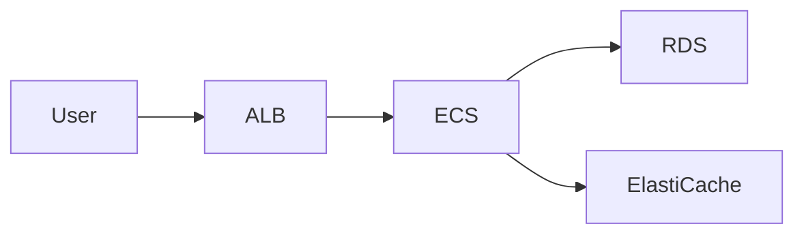
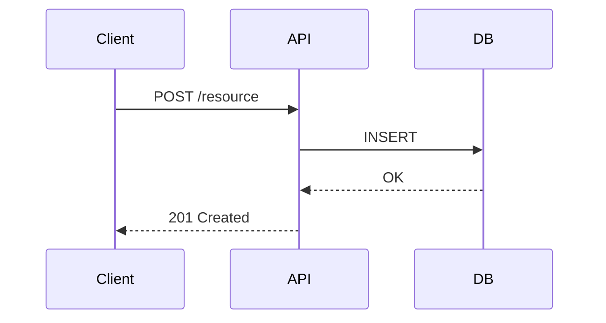
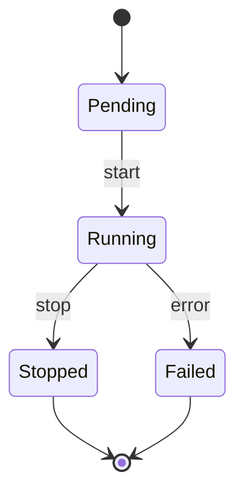

## Overview

Mermaid is a JavaScript-based diagramming tool that renders text definitions into SVG diagrams. It solves documentation decay by keeping diagrams as code alongside the content they describe — no external tooling required. This repo uses Mermaid for all architecture diagrams, sequence diagrams, and flowcharts in `.md` files.

## Key Concepts

- Diagrams are defined as fenced `mermaid` code blocks in Markdown files.
- Rendered to SVG by the Mermaid JS library (v11+) in supported renderers (GitHub, GitLab, Obsidian, VS Code, Notion).
- GitHub natively renders Mermaid in `.md` files — no plugin needed.
- All diagrams in this repo live in `docs/architecture/`, `docs/runbooks/`, or inline in `wiki/` pages.

## Supported Diagram Types

| Type | Keyword | Use case |
|---|---|---|
| Flowchart | `flowchart` | Decision trees, process flows, architecture overviews |
| Sequence | `sequenceDiagram` | Request/response flows, API interactions |
| Class | `classDiagram` | Object models, type hierarchies |
| State | `stateDiagram-v2` | State machines, lifecycle diagrams |
| ER | `erDiagram` | Database schemas |
| Gantt | `gantt` | Project timelines |
| Git Graph | `gitGraph` | Branch strategies |
| Mindmap | `mindmap` | Concept maps, brainstorming |
| Timeline | `timeline` | Chronological events |
| C4 | `C4Context` | System context / container diagrams |
| Architecture | `architecture-beta` | Infrastructure topology (experimental) |
| Pie | `pie` | Proportional data |
| Quadrant | `quadrantChart` | 2×2 prioritization |
| Sankey | `sankey-beta` | Flow/cost distribution (experimental) |

## Patterns

**Architecture overview (flowchart LR)**

Use `LR` (left-right) for multi-tier architectures. Use `TD` (top-down) for hierarchies.

**Sequence diagram for API flows**

`->>` is solid arrow (synchronous); `-->>` is dashed (response/async).

**State machine**

## Gotchas

- **Special characters break rendering** — avoid `<`, `>`, `"` unescaped in node labels; use quotes around labels with spaces: `A["My Label"]`.
- **Subgraph naming** — subgraph IDs must be unique and cannot contain spaces; use quotes for display names: `subgraph sg1["My Group"]`.
- **GitHub rendering lag** — GitHub caches rendered SVGs; a force-refresh (Ctrl+Shift+R) is sometimes needed after pushing changes.
- **`architecture-beta` is experimental** — the `architecture` diagram type may change syntax between Mermaid versions; pin the version in `mermaid.initialize()` if stability matters.
- **Sanitization incompatibility** — standard HTML sanitizers strip Mermaid's special characters; if embedding in user-generated content, use Mermaid's own `securityLevel: "sandbox"` option.
- **Node v16+ required** — for CLI/build-time rendering via `@mermaid-js/mermaid-cli`.

## References

- [[Concepts/Google SRE Book]]
- Live editor: mermaid.live
- Docs: mermaid.js.org
